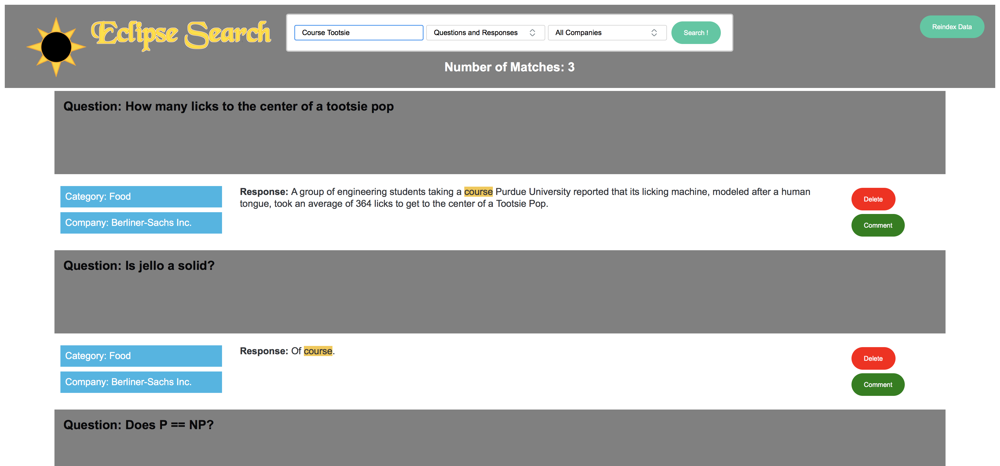

## Eclipse Search
Web app GUI for searching data with Solr

Originally developed for HiredScore Inc. by Jesse Berliner-Sachs

### How to use
1. Clone repo
1. Define the following environment variables:
	* DB_URL = Solr backend url
	* SOLR\_CORE_NAME = Sore core name
	* ECLIPSE_PORT = port to display GUI on or default, 5015
1. Run shell command `$ python search.py`

